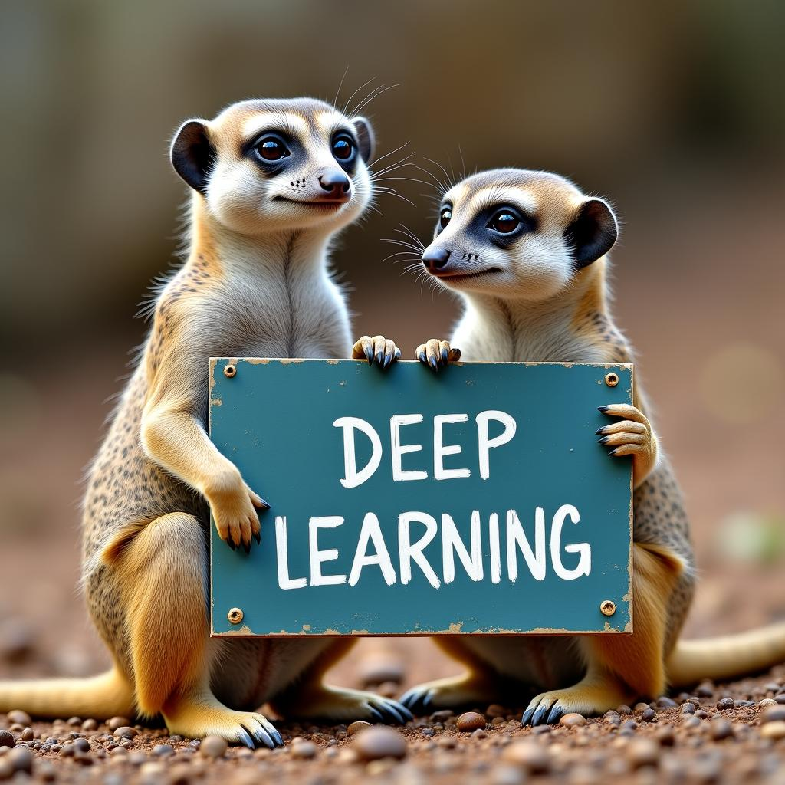

## Hi ! Welcome to Lalit Swami GitHub Page

<!--

-->
 

### About Me
---
Worked as a **Lead Data Scientist** at PayU Finance, Gurgaon, with **5+ years** of experience in FinTech and RideTech. My work focuses on solving critical business problems using big data tools and machine learning methodologies. I've built and deployed several impactful data science solutions, leading end-to-end data pipelines from conceptualization to production.

Previously, I contributed as a Data Scientist at OLA, Bengaluru, where I worked on dynamic pricing, customer and driver experience enhancements, and large-scale web scraping projects. I’m passionate about extracting insights from data and helping organizations make better decisions by asking the right questions.

I graduated from **IIT Delhi** with a B.Tech. in Chemical Engineering and a Minor in Technologies for Sustainable Rural Development. I’m a self-taught data scientist who is continuously learning and improving.

I'm always looking for opportunities to collaborate on challenging projects to expand my knowledge base and sharpen my skills.

### Programming & Tools
---

	
	
	
	
	
	
	
	
	

	
	
	
	
 	
	
	
<!-- 	
 	 -->

 

### GitHub Projects
---

### **Predictive Modeling**

**[Title](https://github.com/swamilalit/swamilalit)**

 A short description about the project. 

<!--
**[Title](https://github.com/swamilalit/swamilalit)**

 A short description about the project. 

-->
 

<!--
### **Segmentation**

**[Title](https://github.com/swamilalit/swamilalit)**

 A short description about the project. 

 
-->

### **Recommendation Engine**

**[Title](https://github.com/swamilalit/swamilalit)**

 A short description about the project. 

 

### **Large Language Models (LLMs)**

**[Title](https://github.com/swamilalit/swamilalit)**

 A short description about the project. 

**[Title](https://github.com/swamilalit/swamilalit)**

 A short description about the project. 

 

### **Computer Vision**

**[Hand2CursorTech](https://github.com/swamilalit/Hand2CursorTech)**

 A vision-based system for controlling your computer cursor using hand gestures. Leveraging Python, OpenCV, Mediapipe, and PyAutoGUI for real-time gesture recognition and cursor navigation. 

 

### **Deep Learning**

**[PastaIQ-TypeDetection](https://github.com/swamilalit/PastaIQ-TypeDetection)**

 An advanced image classification model that identifies distinct types of pasta from the provided images. 

 

<!--
### **Web Scraping**

**[Title](https://github.com/swamilalit/swamilalit)**

 A short description about the project. 

 
-->

### **Speech Recognition**

**[Speech2Math](https://github.com/swamilalit/Speech2Math)**

 Convert spoken mathematical expressions into symbolic equations effortlessly. This Python-based tool supports various operations like integrals and derivatives, with an intuitive Streamlit interface for easy interaction. 

 

### **Reinforcement Learning**

**[PathFinderRL](https://github.com/swamilalit/PathfinderRL)**

 A Reinforcement Learning project that navigates a 4x4 grid world using SARSA and Q-Learning algorithms, optimizing rewards while avoiding obstacles. 

 
-->

### About Collaboration & Work Opportunities
---
If you liked what you saw, want to have a chat with me about the portfolio, work opportunities, or collaboration, feel
free to contact me
on [Linkedin](https://img.shields.io/badge/-LinkedIn-blue?style=flat&logo=Linkedin&logoColor=white&link=https://www.linkedin.com/in/lalit-swami/)
.
 

### Github Stats
---
  

<!--
  

-->

