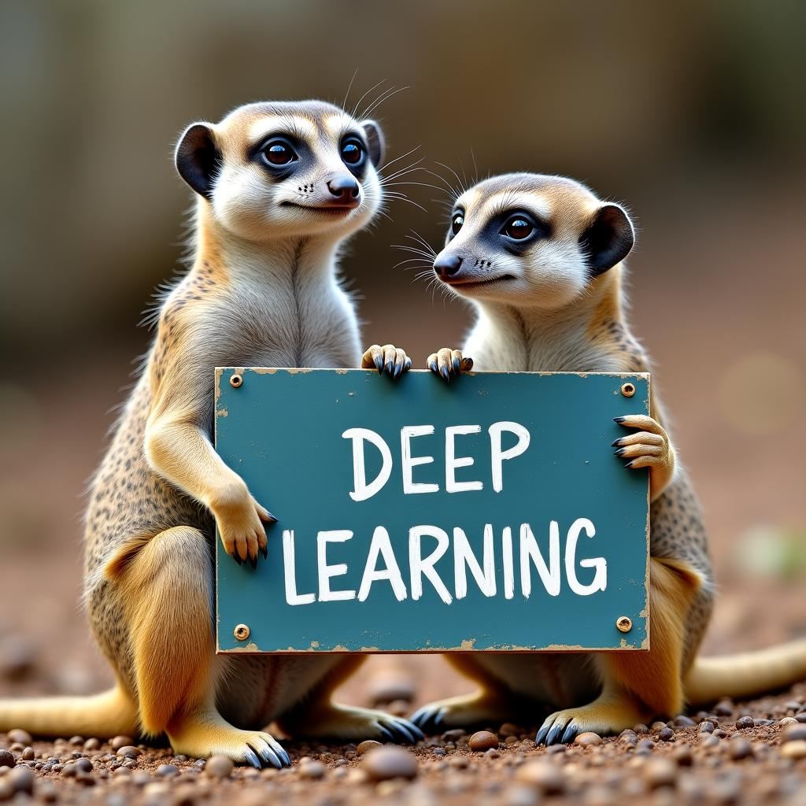

# 🚀 Lalit Swami - GitHub

<!--

-->

---

## 👨‍💼 Professional Summary

**Lead Data Scientist** with **6+ years of experience** delivering high-impact business solutions across **F&B, FinTech, and RideTech industries**. Proven track record of building and deploying **production-ready ML models** that drive measurable business outcomes.

<!-- ### 🎯 Key Achievements
- **Led data science initiatives** at **PayU** and **OLA**, deploying multiple ML models to production
- **Built end-to-end ML pipelines** from data preparation to production deployment
- **Spearheaded MLOps automation** improving system reliability and deployment speed by 40%
- **Developed AI solutions leveraging LLMs** unlocking business value across diverse domains
- **Graduated from IIT Delhi (2019)** with strong foundation in data science and machine learning -->

---

## 🛠️ Technical Expertise

### **Machine Learning & AI**
- **Deep Learning:** Neural Networks, CNN, RNN, Transformers
- **NLP:** Text Classification, Sentiment Analysis, Named Entity Recognition
- **Computer Vision:** Image Classification, Object Detection, Gesture Recognition
- **ML Libraries:** scikit-learn, PyCaret, MLflow, XGBoost, LightGBM, TensorFlow, PyTorch
- **MLOps:** Model Deployment, Monitoring, A/B Testing, CI/CD Pipelines
- **Generative AI:** LLMs, RAG, Prompt Engineering, GPT Integration

### **Programming & Big Data**
- **Languages:** Python, R, SQL, Shell Scripting
- **Big Data:** PySpark, Apache Spark, Hadoop, Apache Hive
- **Workflow:** Apache Airflow, Git, Docker, Kubernetes
- **Cloud:** AWS (SageMaker, Lambda, S3, EC2, Redshift)

### **Business Intelligence & Analytics**
- **Visualization:** Power BI, Streamlit, Matplotlib, Plotly
- **Statistical Modeling:** Predictive Analytics, A/B Testing, KPI Optimization
- **Web Scraping:** Selenium, Beautiful Soup, Data Extraction

---

### GitHub Projects
---

### **Predictive Modeling**

  
  

  
  **[AcademicScorePredictor](https://github.com/swamilalit/AcademicScorePredictor)**  
  
A machine learning pipeline designed to predict student scores, leveraging hyperparameter tuning and deployment to provide insights that help educators and students enhance academic performance.

  **[TravelReviewSentiment](https://github.com/swamilalit/TravelReviewSentiment)**  
  
An end-to-end machine learning solution for classifying TripAdvisor reviews into positive or negative sentiments. Built with PyTorch and powered by DistilBERT.

  

 

<!--
### **Segmentation**

  
  

  
  **[Title](https://github.com/swamilalit/swamilalit)**
  
 A short description about the project. 

  

 
-->

### **Recommendation Engine**

  
  

  
  **[TopBitesDiscoverer](https://github.com/swamilalit/TopBitesDiscoverer)**  
  
A web application designed to help users find the best food options. It uses advanced filtering to recommend top-rated dishes based on reviews, wishlists, and pricing per pax.

  

 

### **Large Language Models (LLMs)**

  
  

  
  **[RAGforRecruiter](https://github.com/swamilalit/RAGforRecruiter)**  
  
A Retrieval-Augmented Generation app that enables HRs to chat with applicants' resumes. Enhance your recruitment process with AI-driven insights and seamless resume analysis.

  

 

### **Computer Vision**

  
  

  
  **[Hand2CursorTech](https://github.com/swamilalit/Hand2CursorTech)**  
  
A vision-based system for controlling your computer cursor using hand gestures. Leveraging Python, OpenCV, Mediapipe, and PyAutoGUI for real-time gesture recognition and cursor navigation. 

  

 

### **Deep Learning**

  
  

  
  **[PastaIQ-TypeDetection](https://github.com/swamilalit/PastaIQ-TypeDetection)**  
  
An advanced image classification model that identifies distinct types of pasta from the provided images.

  

 

<!--
### **Web Scraping**

  
  

  
  **[Title](https://github.com/swamilalit/swamilalit)**
  
 A short description about the project. 

  

 
-->

### **Speech Recognition**

  
  

  
  **[Speech2Math](https://github.com/swamilalit/Speech2Math)**  
  
Convert spoken mathematical expressions into symbolic equations effortlessly. This Python-based tool supports various operations like integrals and derivatives, with an intuitive Streamlit interface for easy interaction.

  

 

### **Reinforcement Learning**

  
  

  
  **[PathFinderRL](https://github.com/swamilalit/PathfinderRL)**  
  
A Reinforcement Learning project that navigates a 4x4 grid world using SARSA and Q-Learning algorithms, optimizing rewards while avoiding obstacles.

  

 

## 📈 GitHub Statistics

  

---

## 🔗 Connect & Collaborate

I'm always open to discussing **exciting opportunities**, **collaborations**, or **challenging projects** that push the boundaries of what's possible with data science and AI.

**Let's connect and explore how we can create value together!**

- **📧 Email:** swamilalit2014@gmail.com | lalit.swami@alumni.iitd.ac.in
- **💼 LinkedIn:** [Lalit Swami](https://www.linkedin.com/in/lalit-swami/)
- **🌐 Portfolio:** [swamilalit.github.io](https://swamilalit.github.io/)

---

  
### 🚀 **Ready to Transform Data into Business Value**
  
*"Data is the new oil, but AI is the refinery that extracts its true value"*

