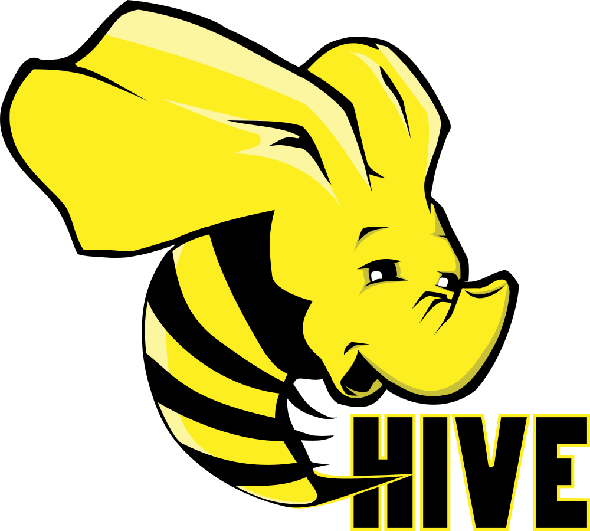

## Hi ! Welcome to Lalit Swami GitHub Page

 

### About Me
---
Currently working in Data Science Team of OLA, Bangalore. Work Experience of **1.5+ years** in solving critical business problems with the help of big data tools using different machine learning methodologies, predictive analytics and statistical modelling. Passionate about extracting insights, visualise and help making better decisions with data. Graduated from **IIT Delhi** in 2019. 

Projects Worked On at OLA:
 
**Customer Experience** - User Category Reordering Model, User Premiumness Score (Scraped Websites), Ride Intent Mapping, Drop Suggestion, User Preference Model
 
**Platform Pricing** - Underpriced Trips, Loss of Utilisation, Peak Simulation of Auto & Cabs
 
**Partner Lifecycle Management** - Driver Churn Models, Driver Scores
 
**Allocation of Cab Supply** - Effective Supply in Allocation of City Cabs

 

### Programming & Tools
---

	
	
	
	
	
	

	
	
	
	
	
	

 

### Github Projects
---

### **Machine Learning Classification Problems**

**[Predicting Spotify Songs Likes/Dislikes](https://github.com/swamilalit/predicting_spotify_songs)**
 
Working on Predicting User Choices in their Songs. 
 
**[Predicting Spotify Songs Popularity](https://github.com/swamilalit/predicting_spotify_popularity)**
 
Working on Predicting Users Songs Popularity.
 
 
 
 

### About Collaboration & Work Opportunities
---
If you liked what you saw, want to have a chat with me about the portfolio, work opportunities, or collaboration, feel free to contact me on [Linkedin](https://img.shields.io/badge/-LinkedIn-blue?style=flat&logo=Linkedin&logoColor=white&link=https://www.linkedin.com/in/lalit-swami/).

